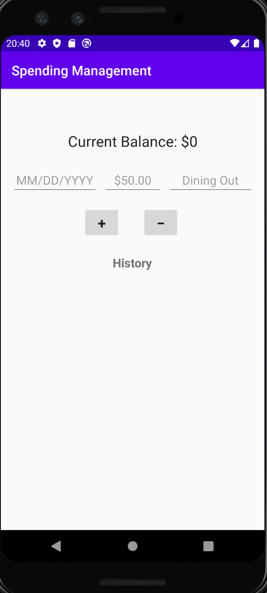
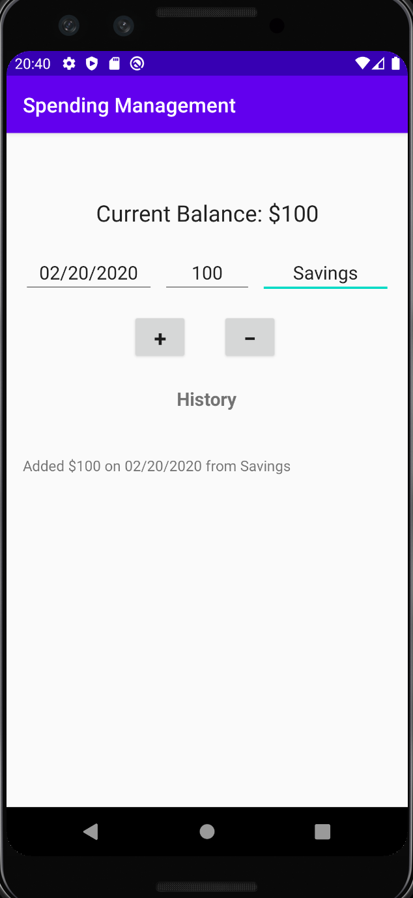

# SpendingManagement
## User Stories
System Metaphor:
As a user, I want to be able to track my spending in order to better save money. I will enter the date in the date form, a money amount in the money amount form, and a purpose in the purpose form for a brief description of the entry.

1) As a user, I want to record that I added $100 on the 20th of February from my savings. I will first click on the date form. The system will respond by pulling up the number key pad. I will tap 02/20/2020. Next, I will click the money form. The system will respond by pulling up the number key pad. I will tap 100. Then, I will click the purpose form. The system will respond by pulling up a full keyboard. I will type "Savings." Finally, I will click the + (plus) button. The system will respond by updating my balance at the top of the screen to $100, and it will record the history underneath the plus and minus buttons: "Added $100 on 02/20/2020 from Savings."

2) As a user, I want to record that I spent $13.44 on the 22nd of February on dining out. I will first click on the date form. The system will respond by pulling up the number key pad. I will tap 02/22/2020. Next, I will click the money form. The system will respond by pulling up the number key pad. I will tap 13.44. Then, I will click the purpose form. The system will respond by pulling up a full keyboard. I will type "Dining Out." Finally, I will click the - (minus) button. The system will respond by updating my balance at the top of the screen to $86.56, and it will record the history underneath the plus and minus buttons: "Spent $13.44 on 02/22/2020 on Dining Out."

3) As a user, I want to be able to close the app and return to it later without losing my data. I will quit the app entirely and force close it. I will then reopen it. The system will respond by having all of my information already populated on the screen for me.

## UI Sketches
Empty UI Sketch:

UI Sketch with Entries:

